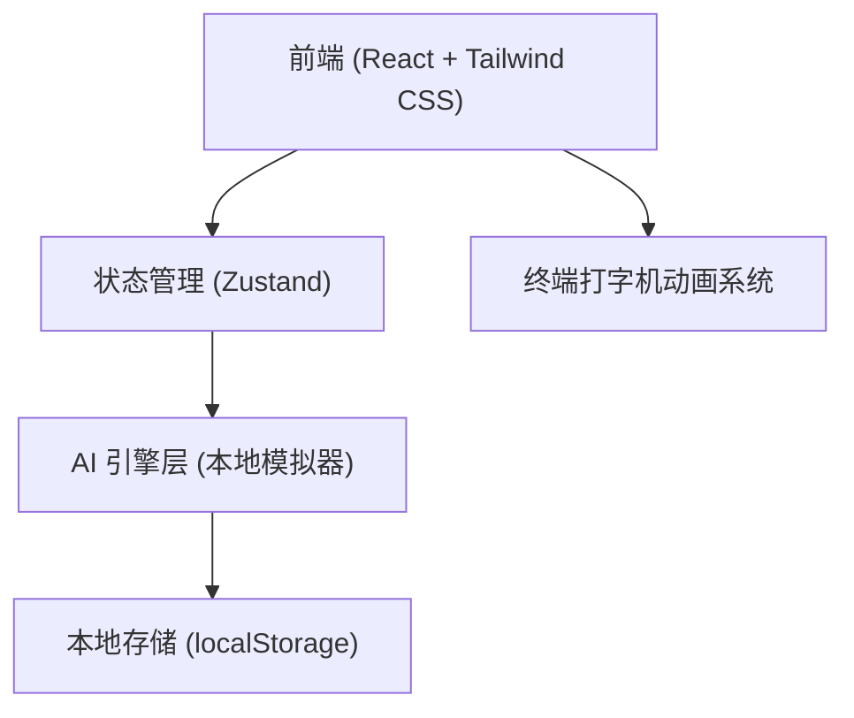
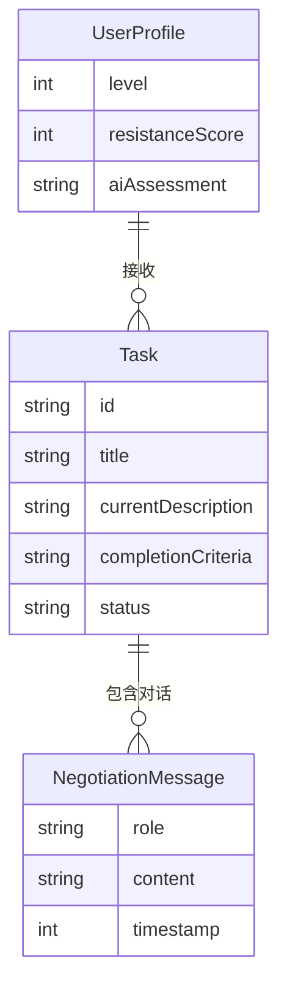

## 1. 架构设计


## 2. 技术描述
- **前端框架**: React 18 + Vite
- **UI & 样式**: Tailwind CSS 3 (自定义主题与等宽字体)
- **图标**: Lucide React
- **动画**: Framer Motion (用于终端打字机效果、对话流滚动、界面切换)
- **数据持久化**: localStorage (纯前端实现)
- **AI模拟逻辑**: 
  - 由于是纯前端项目，AI的“开放式反馈响应”将通过一个本地的“模拟智能体(Mock AI Engine)”实现。
  - 该引擎会包含关键词匹配和多分支状态机（如检测到“不知道”、“怎么做”，则触发【场景构建】响应模式；检测到“太难”、“做不到”，则触发【任务降级/嘲讽】模式）。以此在纯前端模拟出灵活的AI行为。

## 3. 路由定义
| 路由 | 目的 |
|-------|---------|
| `/` | 控制台主页 (展示今日指令列表) |
| `/task/:id` | 任务博弈页 (与AI进行开放式文本反馈，重塑任务的终端界面) |
| `/archive` | 突破档案页 (历史任务与AI用户画像分析) |

## 4. 核心数据结构与接口模拟
```typescript
// 任务实体，包含动态变化的属性
interface Task {
  id: string;
  title: string;
  currentDescription: string; // 会根据反馈动态变化的描述
  completionCriteria: string; // 明确的完成标准
  status: 'negotiating' | 'accepted' | 'completed' | 'failed';
  negotiationLog: NegotiationMessage[]; // 博弈历史
}

// 博弈对话消息
interface NegotiationMessage {
  id: string;
  role: 'ai' | 'user';
  content: string;
  timestamp: number;
}

// 用户画像类型
interface UserProfile {
  level: number;
  resistanceScore: number; // 用户的抗拒指数（反馈越频繁越高）
  aiAssessment: string; // AI冷酷的评语
}
```

## 5. 数据模型
### 5.1 数据模型定义
