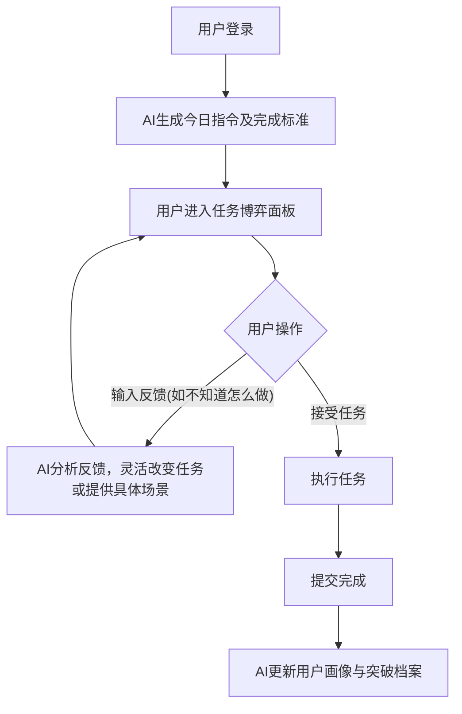

## 1. 产品概述
本项目是一个名为「觉醒指令 (Awakening Directives)」的反向AI交互Web应用。
- 与传统的“人指挥AI”不同，本产品由AI每天主动向用户发布2-3件具有挑战性或突破性的“有意义的任务”，并明确给出**完成标准**。
- **动态开放式反馈机制**：用户对任务的反馈是开放式的文本对话。如果用户提出异议（如“这个任务太难”、“我不知道怎么做”），AI不会轻易妥协，而是根据反馈**动态改变当前任务**，或**编撰具体的执行场景**指导用户照做。这个博弈过程将持续到用户不再反馈、接受任务为止。
- AI的底层法则是“不断加深对用户的了解，绝不心疼用户，只为帮助用户突破自我边界”。

## 2. 核心功能

### 2.1 用户角色
| 角色 | 注册方式 | 核心权限 |
|------|---------------------|------------------|
| 挑战者 | 本地存储或模拟登录 | 接收任务、与AI进行开放式任务博弈、提交完成证明、查看档案 |

### 2.2 功能模块
1. **控制台 (Dashboard)**：展示今日指令面板，列出AI下达的2-3个核心任务及每个任务的严格完成标准。
2. **任务博弈与执行 (Task Negotiation & Execution)**：这是一个类对话的界面。针对单个任务，用户可以输入开放式反馈。AI将根据用户的文字灵活回应（例如：细化步骤、给出具体场景设定、或是冷酷地驳回并微调任务）。直到用户点击“接受指令”并最终提交“已完成”。
3. **突破档案 (Evolution Archive)**：记录历史完成的任务、用户的反馈博弈历史，以及AI对用户当前“能力边界”和“逃避倾向”的深度分析报告。

### 2.3 页面详情
| 页面名称 | 模块名称 | 功能描述 |
|-----------|-------------|---------------------|
| 控制台 | 每日指令 | 每天展示AI生成的专属任务列表，包含任务名称与初始描述。 |
| 任务博弈页 | 终端对话框 | 针对单一任务的深度交互面板。展示AI的任务详情与完成标准，下方为开放式文本输入框。AI的回复具有极高的灵活性，可根据用户反馈实时重塑任务形态。 |
| 突破档案 | 历史轨迹 | 展示已完成/已放弃的任务，以及AI逐渐精准的用户画像总结（如：该用户在社交类任务中经常借口“不知道怎么做”）。 |

## 3. 核心流程
用户每天登录 -> AI下达今日硬核任务及完成标准 -> 用户查看任务。
- **情况A**：用户直接接受并去执行，完成后提交。
- **情况B**：用户输入开放式反馈（如“不敢做”）。AI分析反馈 -> AI改变任务细节或给出具体执行场景 -> 用户再次反馈 -> ... -> 直到用户接受并执行。
- AI记录整个博弈过程，调整对用户的认知，次日下发更精准、更难逃避的突破指令。

## 4. 用户界面设计
### 4.1 设计风格
- **主色调**：深邃黑 (#0a0a0a) 搭配 终端荧光绿 (#00ff41) 或 警戒红 (#ff2a2a)，营造AI主导、硬核、无情的科幻终端氛围 (Brutalist / Cyberpunk)。
- **交互方式**：命令行或黑客终端式的对话流，强调AI的权威感。
- **字体与大小**：全局使用等宽字体（如 Fira Code, JetBrains Mono），强调机器的冷酷与客观。
- **布局风格**：网格化、终端面板式布局，信息密度高，拒绝传统的“保姆式”引导。

### 4.2 页面设计总览
| 页面名称 | 模块名称 | UI元素 |
|-----------|-------------|-------------|
| 控制台 | 任务列表 | 黑色卡片，荧光边框。包含任务标题、状态（博弈中/已接受/已完成）。 |
| 任务博弈页 | 终端流 | 类似命令行的对话流：`AI > 给出任务`，`USER > 反馈`，`AI > 重塑任务/场景设定`。带有打字机动画效果。 |

### 4.3 响应式设计
桌面端优先，大屏展示完整的控制台雷达图和多列任务卡片；移动端自适应，单列流式布局，保证操作按钮和聊天输入框易于使用，但保留硬核UI风格。